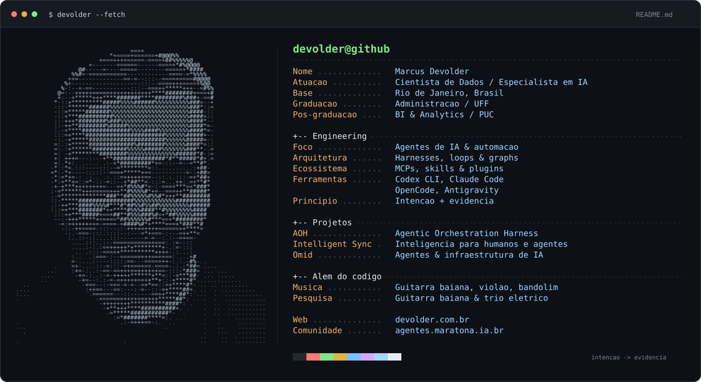

<!-- Apresentacao do perfil de Marcus Devolder. -->

[Site](https://devolder.com.br) · [Comunidade Maratona Agentes](https://agentes.maratona.ia.br/)

Sobre mim — versão em texto

Sou **Marcus Devolder**, cientista de dados e especialista em IA, no Rio de Janeiro. Sou formado em Administração pela UFF e pós-graduado em BI e Analytics pela PUC.

Trabalho com agentes de IA, automação e orquestração: harnesses, loops, graphs, MCPs, skills e plugins. Uso Codex CLI, Claude Code, OpenCode e Antigravity. Meus projetos incluem AOH, Intelligent Sync e Omid.

Também sou músico e pesquisador da história da guitarra baiana e do trio elétrico.

